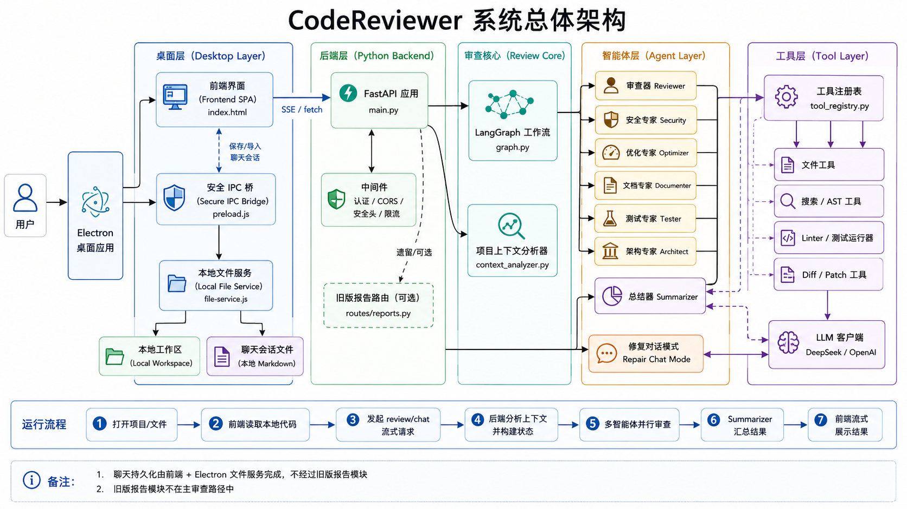

# CodeReview AI

多智能体代码审查与自动修复工具。支持单文件审查、多文件项目分析、对话式修复、Electron 桌面应用。



## 结构

```
codereviewer/
├── backend/
│   ├── main.py                  # FastAPI 入口，SSE 流式响应
│   ├── config.py                # 集中配置（端口、限制、路径）
│   ├── exceptions.py            # 自定义异常（AgentError、ToolError 等）
│   ├── state.py                 # 审查状态类型定义
│   ├── intent.py                # LLM 意图分类（review / repair / plan_exec / chat）
│   ├── prompts.py               # Agent 提示词集中管理
│   ├── routing.py               # 关键词 → Agent 路由规则
│   ├── agents/
│   │   ├── base.py              # Agent 基类（模板方法模式）
│   │   ├── graph.py             # LangGraph 多智能体并行编排
│   │   ├── reviewer.py          # 代码质量审查（逻辑/命名/可读性）
│   │   ├── security.py          # 安全漏洞检测（注入/XSS/密钥泄露）
│   │   ├── optimizer.py         # 性能瓶颈分析（复杂度/内存/缓存）
│   │   ├── documenter.py        # 文档完整性检查
│   │   ├── tester.py            # 测试质量评估
│   │   ├── architect.py         # 架构设计评审
│   │   ├── summarizer.py        # 元裁判（交叉验证 + 综合评分）
│   │   └── repair.py            # 对话式多轮自动修复
│   ├── tools/
│   │   ├── llm.py               # LLM 工厂（DeepSeek / OpenAI 兼容）
│   │   ├── agent_json.py        # LLM 响应 JSON 解析器
│   │   ├── tool_registry.py     # 统一工具注册与执行器（OpenAI function-calling）
│   │   ├── ast_parser.py        # Tree-sitter AST 解析
│   │   ├── file_tool.py         # 文件操作（read / grep / glob / edit / write）
│   │   ├── code_search.py       # AST 符号搜索（定义/引用查找）
│   │   ├── context_analyzer.py  # 3 层项目上下文分析（50%+30%+10% 令牌分配）
│   │   ├── diff_tool.py         # 统一 diff 生成与应用
│   │   ├── git_tool.py          # Git 集成
│   │   ├── test_runner.py       # 测试执行器（pytest）
│   │   ├── linter_runner.py     # 多语言静态检查（ruff/flake8/pylint/eslint）
│   │   └── token_budget.py      # 每日 LLM 令牌配额追踪
│   ├── middleware/
│   │   ├── security_headers.py  # 安全响应头（CSP / X-Frame / XSS）
│   │   ├── rate_limit.py        # 速率限制（slowapi）
│   │   └── auth.py              # API Key 认证
│   ├── routes/
│   │   └── reports.py           # 报告列表与获取 API
│   └── output/
│       └── report.py            # Markdown 报告生成与保存
├── frontend/
│   ├── index.html               # SPA 单页应用（暗色主题，响应式布局）
│   └── js/
│       ├── api.js                # API 通信层（SSE 流 + 自动重连）
│       └── utils.js              # 工具函数
├── electron/
│   ├── main.js                  # Electron 主进程（窗口管理 + Python 生命周期）
│   ├── preload.js               # 安全 IPC 桥接（contextBridge）
│   └── file-service.js          # 文件系统 IPC 处理（目录扫描/读写/对话框）
├── assets/
│   ├── arc.png                  # 系统架构图
│   └── hero.png                 # 应用主视觉
├── scripts/
│   └── generate_docs.py         # 文档生成脚本
├── docs/                        # 项目文档（技术报告/部署说明/用户手册）
├── tests/                       # 测试用例
├── reports/                     # 审查报告自动保存目录
├── requirements.txt
├── package.json                 # Electron 入口 + npm scripts
├── package-lock.json
├── .env.example                 # 环境变量模板
├── .gitignore
└── README.md
```

## 架构

```
用户 → [Electron / 浏览器]
            │
     ┌──────▼──────┐
     │   FastAPI   │  ← CORS / Auth / RateLimit / SecurityHeaders
     │  (main.py)  │
     └──────┬──────┘
            │
     ┌──────▼──────┐
     │  意图分类    │  ← LLM: review / repair / plan_exec / chat
     │  (intent.py) │
     └──┬───┬───┬──┘
        │   │   │
  ┌─────▼┐ ┌▼──┐ └──────┐
  │Review│ │Fix│  Chat  │
  └──┬───┘ └─┬─┘        │
     │       │           │
 ┌───▼───────▼───┐       │
 │  LangGraph    │       │
 │  并行 6 Agent  │       │
 │  + Summarizer │       │
 └───────┬───────┘       │
         │               │
 ┌───────▼───────────────▼──┐
 │     Tool Registry        │
 │  12 个工具（LLM 可调用）   │
 │  read_file / grep / glob │
 │  run_linter / run_tests  │
 │  replace_code / write... │
 └──────────────────────────┘
```

## 功能

| 功能 | 说明 |
|------|------|
| **单文件审查** | 粘贴代码 → 6 个 Agent 并行分析 → 综合报告 |
| **多文件项目审查** | 加载整个项目 → 3 层上下文分析 → 审查主文件 |
| **对话式修复** | 审查后直接对话 → LLM 调用工具自动修改代码 |
| **意图自动识别** | LLM 判断用户意图（审查/修复/执行计划/聊天） |
| **SSE 实时流** | 每个 Agent 的思考过程、工具调用实时展示 |
| **报告自动保存** | 审查报告自动保存为 Markdown 到 `reports/` |
| **Electron 桌面端** | 原生桌面体验，自定义标题栏，系统文件对话框 |
| **安全中间件** | CORS、API Key、速率限制、安全响应头 |

## 8 个审查 Agent

| Agent | 职责 | 输出 |
|-------|------|------|
| **Reviewer** | 代码逻辑、命名规范、可读性、注释质量 | issues + quality_score |
| **Security** | SQL 注入、XSS、CSRF、密钥泄露、RCE | issues + security_score |
| **Optimizer** | 时间复杂度、内存使用、缓存策略 | issues + performance_score |
| **Documenter** | 函数/类文档、类型注解、README | issues + doc_score |
| **Tester** | 测试覆盖率、断言质量、边界用例 | issues + test_score |
| **Architect** | 模块划分、依赖关系、设计模式 | issues + architecture_score |
| **Summarizer** | 交叉验证去重 + 冲突仲裁 + 综合评分 | final_report + overall_score |
| **Repair** | 对话式多轮修复，直接调用工具修改代码 | 文件变更 |

## 前置要求

| 环境 | 版本要求 |
|------|----------|
| Python | >= 3.10 |
| Node.js | >= 18（Electron 桌面端需要） |
| pip | 任意 |

## 快速启动

```bash
# 1. 进入项目目录
cd codereviewer

# 3. 创建虚拟环境（推荐）
python -m venv venv

# Windows
venv\Scripts\activate
# macOS / Linux
source venv/bin/activate

# 4. 配置 Python 路径 — 编辑 electron/config.json
# 将 pythonPath 改为虚拟环境中的 python.exe 路径
# Windows 示例: "venv\\Scripts\\python.exe"
# macOS/Linux 示例: "venv/bin/python"

# 5. 安装 Python 依赖
pip install -r requirements.txt

# 6. 安装 Node.js 依赖（Electron）
npm install

# 7. 配置环境变量
cp .env.example .env
# 编辑 .env 填入 API Key
# 至少配置 DEEPSEEK_API_KEY（推荐）或 OPENAI_API_KEY

# 8. 一键启动（Electron 桌面端 + Python 后端）
npm start
```

`npm start` 会自动：
1. 启动 Python FastAPI 后端（端口 8765）
2. 健康检查等待后端就绪
3. 打开 Electron 桌面窗口加载前端

### 仅启动后端（浏览器访问）

```bash
uvicorn backend.main:app --reload --port 8765
# 浏览器打开 http://localhost:8765
```

## 使用

1. 粘贴代码或点击「打开文件」/「打开文件夹」
2. 选择语言（Python / JavaScript / TypeScript / Java / C++ / Go）
3. 点击「开始审查」→ 实时观看 6 个 Agent 并行分析
4. 查看「问题列表」和「综合报告」
5. 点击「修复」进入对话式修复模式
6. 报告自动保存到 `reports/` 目录

## API 端点

| 端点 | 方法 | 说明 |
|------|------|------|
| `/api/health` | GET | 健康检查 + LLM 配置状态 |
| `/api/review/stream` | POST | 单文件 SSE 流式审查 |
| `/api/review/project` | POST | 多文件项目 SSE 流式审查 |
| `/api/chat/stream` | POST | 对话式 SSE（审查/修复/聊天） |
| `/api/reports` | GET | 列出所有报告 |
| `/api/reports/{filename}` | GET | 获取指定报告 |

## 依赖

| 包 | 用途 |
|----|------|
| `fastapi` + `uvicorn` | Web 服务器 + ASGI |
| `langgraph` | 多智能体工作流编排 |
| `langchain` + `langchain-openai` | LLM 调用（兼容 DeepSeek / OpenAI） |
| `openai` | OpenAI SDK |
| `tree-sitter` + `tree-sitter-python` + `tree-sitter-javascript` | AST 代码解析 |
| `pydantic` | 请求/响应数据验证 |
| `python-dotenv` | 环境变量加载 |
| `json-repair` | LLM 输出 JSON 自动修复 |
| `slowapi` | API 速率限制 |
| `sse-starlette` | Server-Sent Events 支持 |

## 配置

| 环境变量 | 说明 | 默认值 |
|----------|------|--------|
| `HOST` | 绑定地址 | `127.0.0.1` |
| `PORT` | 绑定端口 | `8765` |
| `DEEPSEEK_API_KEY` | DeepSeek API 密钥 | - |
| `DEEPSEEK_MODEL` | DeepSeek 模型名 | `deepseek-chat` |
| `OPENAI_API_KEY` | OpenAI API 密钥（备用） | - |
| `APP_API_KEY` | 应用 API 认证密钥（可选） | - |
| `DAILY_TOKEN_LIMIT` | 每日令牌配额 | `1000000` |
| `WORKSPACE_ROOT` | 工作区根目录 | 当前目录 |


